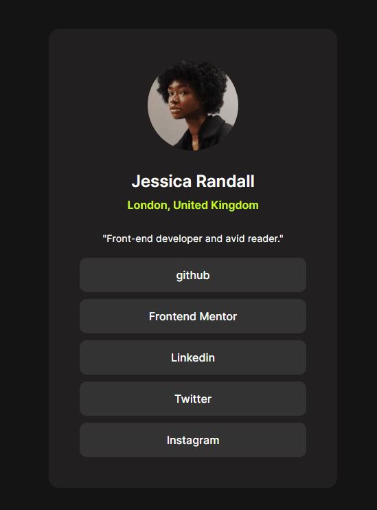
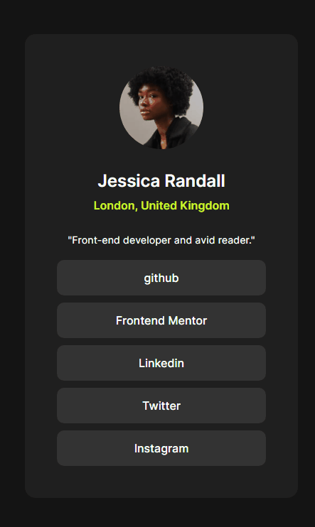

<h2>Desafio Perfil de Links Pessoais</h2>
<h3>🔗 Link do desafio</h2>
👉 <a href="https://www.frontendmentor.io/challenges/social-links-profile-UG32l9m6dQ" target="_blank">Desafio Frontend Mentor  👓</a>

#

<h3>🔗 Link da página</h2>

Abaixo temos o link da página para visualização e testes:

👉 <a href="https://marvin1423.github.io/social-links-profile/" target="_blank">Social Links Profile ⚔</a>

#

<h4>Versão Desktop 💻👇 ------------------------ 👇📱 Versão Mobile</h4>  

 
 <h2>🕹️ Tecnologias Utilizadas</h2>
    <ul align="center">
        
        
  

<h3>Utilização de tags semânticas</h3>
<h3>Site responsivo para diversos dispositivos</h3>
<h3>Site estilizado para a melhor experiência do usuário</h3>
    </ul>

#

<h3 align="center">📐 Página Responsiva ✂️</h3>

O projeto apresenta responsividade na navegação dos principais dispositivos:

<ul>
    <li>Desktop 🖥️</li>
    <li>Tablet 💻</li>
    <li>Smartphone 📱</li>
</ul>

Obrigado por visitar meu projeto! ✨🎉

